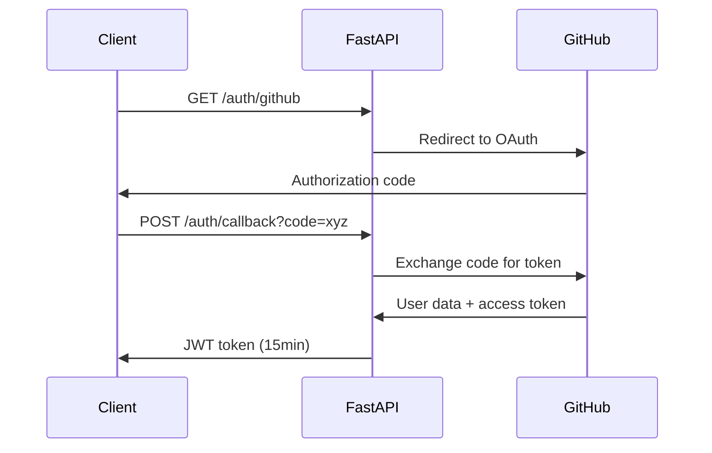

# API Design & Specifications

## Document Information
- **Version:** 1.0
- **Date:** September 25, 2025
- **Author:** Winston (Architect)
- **Related:** [Architecture Overview](architecture.md), [Database Schema](database-schema.md)

## API Overview

### Core Specifications
- **Framework:** FastAPI 0.104.1
- **OpenAPI:** 3.0.3 (automatically generated)
- **Authentication:** JWT Bearer tokens (15-minute expiry)
- **Base URL:** `http://localhost:8000/api/v1`
- **Documentation:** Auto-generated at `/docs` (Swagger UI)

### Design Principles
- **RESTful:** Resource-based URLs with standard HTTP methods
- **Consistent:** Uniform response patterns across all endpoints
- **Secure:** Authentication required for all endpoints
- **Performant:** Optimized for async operations
- **Documented:** Comprehensive OpenAPI specifications

## Authentication & Authorization

### OAuth Flow


### Authentication Endpoints

#### `GET /auth/github`
Start GitHub OAuth flow
```json
{
  "description": "Redirect to GitHub OAuth",
  "response": {
    "redirect_url": "https://github.com/login/oauth/authorize?client_id=..."
  }
}
```

#### `POST /auth/callback`
Complete OAuth and get JWT token
```json
{
  "parameters": {
    "code": "string",
    "state": "string"
  },
  "response": {
    "access_token": "jwt_token_here",
    "token_type": "bearer",
    "expires_in": 900,
    "user": {
      "id": 1,
      "username": "developer1",
      "role": "developer",
      "avatar_url": "https://github.com/avatar.jpg"
    }
  }
}
```

#### `POST /auth/refresh`
Refresh JWT token
```json
{
  "headers": {
    "Authorization": "Bearer expired_jwt_token"
  },
  "response": {
    "access_token": "new_jwt_token",
    "expires_in": 900
  }
}
```

## User Management API

### `GET /users/me`
Get current user profile
```json
{
  "headers": {
    "Authorization": "Bearer jwt_token"
  },
  "response": {
    "id": 1,
    "username": "developer1",
    "email": "dev@example.com",
    "role": "developer",
    "avatar_url": "https://github.com/avatar.jpg",
    "is_active": true,
    "created_at": "2025-09-25T10:00:00Z"
  }
}
```

### `GET /users`
List all users (admin only)
```json
{
  "headers": {
    "Authorization": "Bearer admin_jwt_token"
  },
  "query_params": {
    "role": "developer",
    "is_active": true,
    "limit": 50,
    "offset": 0
  },
  "response": {
    "users": [
      {
        "id": 1,
        "username": "developer1",
        "role": "developer",
        "is_active": true
      }
    ],
    "total": 10,
    "limit": 50,
    "offset": 0
  }
}
```

## Task Management API

### `GET /tasks`
List tasks with filtering
```json
{
  "headers": {
    "Authorization": "Bearer jwt_token"
  },
  "query_params": {
    "status": "todo",
    "assigned_role": "developer",
    "assigned_user_id": 1,
    "is_delayed": false,
    "epic_id": "epic-123",
    "limit": 20,
    "offset": 0,
    "sort": "priority,-start_date"
  },
  "response": {
    "tasks": [
      {
        "id": 1,
        "title": "Implement user authentication",
        "description": "Set up GitHub OAuth integration",
        "status": "todo",
        "assigned_role": "developer",
        "assigned_user_id": 1,
        "assigned_user": {
          "id": 1,
          "username": "developer1"
        },
        "start_date": "2025-09-25T00:00:00Z",
        "end_date": "2025-09-30T23:59:59Z",
        "completed_at": null,
        "is_delayed": false,
        "epic_id": "epic-auth",
        "story_id": "story-oauth",
        "priority": 1,
        "created_at": "2025-09-25T10:00:00Z",
        "updated_at": "2025-09-25T10:00:00Z"
      }
    ],
    "total": 5,
    "limit": 20,
    "offset": 0
  }
}
```

### `POST /tasks`
Create new task (admin/project_manager only)
```json
{
  "headers": {
    "Authorization": "Bearer pm_jwt_token"
  },
  "body": {
    "title": "Fix login bug",
    "description": "Users cannot login after password reset",
    "assigned_role": "developer",
    "assigned_user_id": 1,
    "start_date": "2025-09-26T00:00:00Z",
    "end_date": "2025-09-28T23:59:59Z",
    "epic_id": "epic-bugs",
    "story_id": "story-auth-fix",
    "priority": 2
  },
  "response": {
    "id": 2,
    "title": "Fix login bug",
    "status": "todo",
    "created_at": "2025-09-25T11:00:00Z"
  }
}
```

### `PUT /tasks/{task_id}`
Update task
```json
{
  "headers": {
    "Authorization": "Bearer jwt_token"
  },
  "path_params": {
    "task_id": 1
  },
  "body": {
    "status": "in_progress",
    "assigned_user_id": 2
  },
  "response": {
    "id": 1,
    "status": "in_progress",
    "assigned_user_id": 2,
    "updated_at": "2025-09-25T12:00:00Z"
  }
}
```

### `POST /tasks/{task_id}/complete`
Mark task as completed
```json
{
  "headers": {
    "Authorization": "Bearer jwt_token"
  },
  "path_params": {
    "task_id": 1
  },
  "response": {
    "id": 1,
    "status": "done",
    "completed_at": "2025-09-25T12:00:00Z"
  }
}
```

## Notification API

### `GET /notifications`
Get user notifications
```json
{
  "headers": {
    "Authorization": "Bearer jwt_token"
  },
  "query_params": {
    "is_read": false,
    "type": "task_assigned",
    "limit": 20,
    "offset": 0
  },
  "response": {
    "notifications": [
      {
        "id": 1,
        "type": "task_assigned",
        "title": "New Task Assigned",
        "message": "You have been assigned to: Implement user authentication",
        "related_task_id": 1,
        "is_read": false,
        "created_at": "2025-09-25T10:00:00Z",
        "read_at": null
      }
    ],
    "unread_count": 5,
    "total": 20
  }
}
```

### `PUT /notifications/{notification_id}/read`
Mark notification as read
```json
{
  "headers": {
    "Authorization": "Bearer jwt_token"
  },
  "path_params": {
    "notification_id": 1
  },
  "response": {
    "id": 1,
    "is_read": true,
    "read_at": "2025-09-25T13:00:00Z"
  }
}
```

### `POST /notifications/mark-all-read`
Mark all notifications as read
```json
{
  "headers": {
    "Authorization": "Bearer jwt_token"
  },
  "response": {
    "marked_read": 5,
    "message": "All notifications marked as read"
  }
}
```

## Chat API

### `GET /chat/messages`
Get chat messages
```json
{
  "headers": {
    "Authorization": "Bearer jwt_token"
  },
  "query_params": {
    "recipient_id": 2,
    "channel": "general",
    "message_type": "text",
    "limit": 50,
    "offset": 0,
    "before": "2025-09-25T12:00:00Z"
  },
  "response": {
    "messages": [
      {
        "id": 1,
        "sender_id": 1,
        "recipient_id": 2,
        "message": "Hey, can you help with the authentication bug?",
        "message_type": "text",
        "channel": null,
        "is_edited": false,
        "edited_at": null,
        "created_at": "2025-09-25T11:30:00Z",
        "sender": {
          "id": 1,
          "username": "developer1",
          "avatar_url": "https://github.com/avatar.jpg"
        }
      }
    ],
    "total": 25,
    "has_more": true
  }
}
```

### `POST /chat/messages`
Send chat message
```json
{
  "headers": {
    "Authorization": "Bearer jwt_token"
  },
  "body": {
    "recipient_id": 2,
    "message": "Sure, I can help with that!",
    "message_type": "text",
    "channel": null
  },
  "response": {
    "id": 2,
    "message": "Sure, I can help with that!",
    "created_at": "2025-09-25T11:35:00Z"
  }
}
```

### `PUT /chat/messages/{message_id}`
Edit chat message
```json
{
  "headers": {
    "Authorization": "Bearer jwt_token"
  },
  "path_params": {
    "message_id": 2
  },
  "body": {
    "message": "Sure, I can help with that! Let me check the code."
  },
  "response": {
    "id": 2,
    "message": "Sure, I can help with that! Let me check the code.",
    "is_edited": true,
    "edited_at": "2025-09-25T11:36:00Z"
  }
}
```

## Triage API

### `GET /triage`
List triage items
```json
{
  "headers": {
    "Authorization": "Bearer jwt_token"
  },
  "query_params": {
    "status": "pending",
    "priority": "high",
    "assigned_to": 1,
    "reporter_id": 2,
    "category": "issue",
    "limit": 20,
    "offset": 0
  },
  "response": {
    "items": [
      {
        "id": 1,
        "title": "Login system not working",
        "description": "Users can't log in after the latest update",
        "status": "pending",
        "priority": "high",
        "category": "issue",
        "reporter_id": 2,
        "assigned_to": null,
        "resolution": null,
        "resolved_at": null,
        "created_at": "2025-09-25T09:00:00Z",
        "reporter": {
          "id": 2,
          "username": "tester1"
        }
      }
    ],
    "total": 3
  }
}
```

### `POST /triage`
Report new issue
```json
{
  "headers": {
    "Authorization": "Bearer jwt_token"
  },
  "body": {
    "title": "Performance issue on dashboard",
    "description": "Dashboard loads very slowly with >100 tasks",
    "priority": "medium",
    "category": "performance"
  },
  "response": {
    "id": 2,
    "title": "Performance issue on dashboard",
    "status": "pending",
    "created_at": "2025-09-25T14:00:00Z"
  }
}
```

### `PUT /triage/{item_id}/assign`
Assign triage item
```json
{
  "headers": {
    "Authorization": "Bearer pm_jwt_token"
  },
  "path_params": {
    "item_id": 1
  },
  "body": {
    "assigned_to": 1
  },
  "response": {
    "id": 1,
    "assigned_to": 1,
    "status": "in_review",
    "updated_at": "2025-09-25T14:30:00Z"
  }
}
```

## WebSocket API

### Connection Endpoint
`ws://localhost:8000/ws/{user_id}?token={jwt_token}`

### Message Types

#### Real-time Notifications
```json
{
  "type": "notification",
  "data": {
    "id": 5,
    "type": "task_assigned",
    "title": "New Task Assigned",
    "message": "You have been assigned to: Fix performance issue",
    "created_at": "2025-09-25T15:00:00Z"
  }
}
```

#### Task Updates
```json
{
  "type": "task_update",
  "data": {
    "id": 1,
    "status": "in_progress",
    "assigned_user_id": 2,
    "updated_by": "developer1"
  }
}
```

#### Chat Messages
```json
{
  "type": "chat_message",
  "data": {
    "id": 10,
    "sender_id": 1,
    "message": "The authentication fix is ready for testing",
    "channel": "development",
    "created_at": "2025-09-25T15:30:00Z",
    "sender": {
      "username": "developer1",
      "avatar_url": "https://github.com/avatar.jpg"
    }
  }
}
```

#### System Alerts
```json
{
  "type": "system_alert",
  "data": {
    "severity": "warning",
    "title": "Task Delay Detected",
    "message": "Task 'Implement user authentication' is now 2 days overdue",
    "task_id": 1
  }
}
```

## Error Handling

### Standard Error Response
```json
{
  "error": {
    "code": "VALIDATION_ERROR",
    "message": "Invalid input data",
    "details": [
      {
        "field": "start_date",
        "message": "Start date must be before end date"
      }
    ],
    "timestamp": "2025-09-25T16:00:00Z",
    "request_id": "req-123-abc-456"
  }
}
```

### HTTP Status Codes
- **200 OK:** Successful GET, PUT
- **201 Created:** Successful POST
- **204 No Content:** Successful DELETE
- **400 Bad Request:** Invalid input
- **401 Unauthorized:** Missing/invalid authentication
- **403 Forbidden:** Insufficient permissions
- **404 Not Found:** Resource not found
- **409 Conflict:** Resource already exists
- **422 Unprocessable Entity:** Validation error
- **429 Too Many Requests:** Rate limiting
- **500 Internal Server Error:** Server error

### Error Codes
```python
ERROR_CODES = {
    "AUTHENTICATION_REQUIRED": "Authentication token required",
    "INVALID_TOKEN": "Invalid or expired token",
    "INSUFFICIENT_PERMISSIONS": "User lacks required permissions",
    "VALIDATION_ERROR": "Request validation failed",
    "RESOURCE_NOT_FOUND": "Requested resource not found",
    "RESOURCE_CONFLICT": "Resource already exists",
    "RATE_LIMIT_EXCEEDED": "Too many requests",
    "SERVER_ERROR": "Internal server error"
}
```

## Rate Limiting

### Limits by Endpoint Type
```python
RATE_LIMITS = {
    "auth": "5/minute",          # Authentication endpoints
    "tasks": "100/minute",       # Task management
    "chat": "500/minute",        # Chat messages
    "notifications": "200/minute", # Notifications
    "default": "60/minute"       # Other endpoints
}
```

### Rate Limit Headers
```http
X-RateLimit-Limit: 100
X-RateLimit-Remaining: 95
X-RateLimit-Reset: 1632150000
```

## API Versioning

### Version Strategy
- **URL Versioning:** `/api/v1/`, `/api/v2/`
- **Backward Compatibility:** v1 supported for 6 months after v2 release
- **Deprecation Notice:** Headers indicate deprecated endpoints

### Version Headers
```http
API-Version: 1.0
API-Deprecated: false
API-Supported-Versions: 1.0
```

## Performance Optimization

### Caching Strategy
- **Response Caching:** Static data cached for 5 minutes
- **Database Query Caching:** Frequently accessed data
- **Redis Integration:** Session storage and real-time data

### Pagination
```json
{
  "data": [...],
  "pagination": {
    "total": 150,
    "limit": 20,
    "offset": 40,
    "next": "/api/v1/tasks?limit=20&offset=60",
    "previous": "/api/v1/tasks?limit=20&offset=20"
  }
}
```

### Async Operations
- **Background Tasks:** Long-running operations
- **Celery Integration:** Distributed task processing
- **WebSocket Updates:** Real-time progress notifications

## OpenAPI Specification

### Complete Schema
The full OpenAPI 3.0.3 specification is auto-generated by FastAPI and available at:
- **JSON:** `http://localhost:8000/openapi.json`
- **Swagger UI:** `http://localhost:8000/docs`
- **ReDoc:** `http://localhost:8000/redoc`

### Key Features
- **Interactive Testing:** Try endpoints directly in Swagger UI
- **Code Generation:** Client SDKs for multiple languages
- **Validation:** Automatic request/response validation
- **Documentation:** Comprehensive endpoint documentation

Ready for API implementation! íº€
