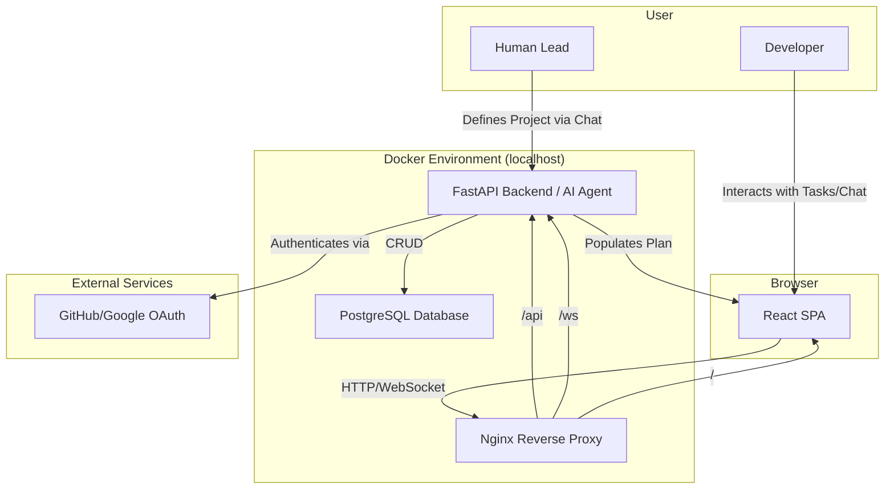

# Atlas Fullstack Architecture Document

| Date | Version | Description | Author |
| :--- | :--- | :--- | :--- |
| 2025-10-01 | 1.0 | Initial architecture document draft. | Winston (Architect) |

## 1. Introduction

This document outlines the complete fullstack architecture for **Atlas**, an intelligent project management system designed to automate task assignment and team coordination. Its purpose is to reduce the operational overhead that burdens development teams, allowing them to focus on execution while the AI agent actively manages the project workflow.

This architecture serves as the single source of truth for all technical and AI-driven development. It consolidates and evolves the concepts from a previous set of distributed documents into a unified, comprehensive guide for the project's next phase.

### 1.1. The Problem
Software development teams are consistently burdened by the high operational overhead of project management. This includes inefficient team coordination, reactive problem management, and a heavy administrative burden on team leads. Existing tools are often passive record-keepers, failing to automate the cognitive and administrative duties required to keep a project on track.

### 1.2. The Solution: Atlas
Atlas is an **active agent**, not a passive tool. It addresses the core problem by automating the main loop of project execution:
1.  **Ingests a Project Plan:** Parses a structured project plan.
2.  **Automates Task Assignment:** Assigns tasks to team members based on role and a defined timeline.
3.  **Tracks Progress:** Allows users to mark tasks as complete with a single click.
4.  **Ensures Momentum:** Automatically assigns the next task upon completion and flags delays.

By automating these workflows, Atlas reduces context-switching and administrative overhead, allowing the team to focus on development and delivery.

### 1.3. Architectural Migration
This document represents an architectural migration from a distributed set of documents to a single, authoritative source. The goal is to provide a clearer, more consistent, and holistic view of the system to guide future development and ensure all components are aligned.

## 2. High Level Architecture

This section establishes the foundational architectural pillars for Atlas. It covers the technical strategy, infrastructure, repository structure, and core design patterns that will guide development.

### Technical Summary
Atlas will be architected as a monolithic full-stack application, containerized with Docker for a consistent, self-contained local development and deployment environment. The process is initiated through a **conversational discovery session** where the AI Agent works with a project lead to define scope and generate the plan. 

The frontend will be a responsive React Single-Page Application (SPA) that visualizes the AI-generated plan. It will communicate with a Python-based FastAPI backend via a REST API for core data operations and WebSockets for real-time chat and notifications. The core of the backend will be the AI Agent, which orchestrates project workflows. A PostgreSQL database will provide persistent storage.

### Platform and Infrastructure Choice
For the MVP, simplicity and speed are paramount. Instead of a complex cloud setup, I recommend a **Docker Compose** based local environment.

*   **Pros:** It perfectly matches the localhost requirement, ensures a consistent environment for all developers, and is simple to set up and manage.
*   **Cons:** It is not scalable for production use, but this is not a goal for the MVP.

**Platform:** Docker Compose
**Key Services:** Nginx (Reverse Proxy), FastAPI (Backend), React (Frontend), PostgreSQL (Database)
**Deployment Host and Regions:** Local Machine

### Repository Structure
A **Monorepo** structure is recommended to manage the tightly coupled frontend and backend codebases efficiently.

*   **Structure:** Monorepo
*   **Monorepo Tool:** npm/pnpm workspaces (lightweight, no heavy tooling needed for this scale)
*   **Package Organization:** `apps/` will contain the `frontend` and `backend` applications. `packages/` will contain shared code, such as TypeScript types, to ensure consistency.

### High Level Architecture Diagram


### Architectural Patterns
*   **Monolithic Service:** The entire backend will be a single, deployable service. _Rationale:_ This simplifies development, testing, and deployment, which is critical for achieving the MVP within the timeline.
*   **Component-Based UI:** The frontend will be built as a collection of reusable React components. _Rationale:_ This promotes maintainability, code reuse, and allows for a more organized and scalable frontend codebase.
*   **Agent-Based System:** The backend's core logic will be centered around an AI agent that manages state and orchestrates workflows. _Rationale:_ This directly reflects the project's primary goal and separates the "brain" from the standard API request/response logic.
*   **API Gateway:** Nginx will act as a single entry point for all incoming traffic, routing requests to the appropriate service. _Rationale:_ This simplifies frontend configuration and centralizes concerns like SSL termination and request logging.
*   **WebSocket Communication:** Real-time features like chat and notifications will use a persistent WebSocket connection. _Rationale:_ This is more efficient than HTTP polling for instant, bidirectional communication.

## 3. Tech Stack

The complete list of technologies, frameworks, and versions chosen for this project is defined in the following document:

**[➡️ View Detailed Tech Stack](./architecture/tech-stack.md)**
## 4. Data Models

### User
**Purpose:** Represents an authenticated user in the system, identified via their GitHub or Google account.

**TypeScript Interface**
```typescript
interface User {
  id: string;
  username: string;
  email: string;
  avatarUrl?: string;
  provider: 'github' | 'google';
}
```

### Project
**Purpose:** Represents a single project, acting as a container for tasks, members, and the project's PRD.

**TypeScript Interface**
```typescript
interface Project {
  id: string;
  name: string;
  description: string;
  ownerId: string;
  prd: string;
  createdAt: Date;
}
```

### ProjectMember
**Purpose:** Defines a user's membership and specific role within a project.

**TypeScript Interface**
```typescript
interface ProjectMember {
  projectId: string;
  userId: string;
  role: string;
}
```

### Task
**Purpose:** Represents a single, assignable unit of work within a project.

**TypeScript Interface**
```typescript
interface Task {
  id: string;
  projectId: string;
  title: string;
  description: string;
  status: 'To Do' | 'In Progress' | 'Done';
  assigneeId: string;
  startDate: Date;
  dueDate: Date;
  createdAt: Date;
}
```

### Issue
**Purpose:** Tracks a blocker or problem reported by a team member that requires triage and resolution.

**TypeScript Interface**
```typescript
interface Issue {
  id: string;
  projectId: string;
  title: string;
  reporterId: string;
  assigneeId?: string;
  status: 'Open' | 'In Progress' | 'Resolved';
  createdAt: Date;
}
```

### ChatMessage
**Purpose:** Represents a single message within the real-time chat system.

**TypeScript Interface**
```typescript
interface ChatMessage {
  id: string;
  projectId: string;
  senderId: string;
  recipientId: string | null;
  content: string;
  timestamp: Date;
}
```

### Notification
**Purpose:** An alert generated by the system to inform a user about a specific event.

**TypeScript Interface**
```typescript
interface Notification {
  id: string;
  userId: string;
  type: 'TASK_ASSIGNED' | 'TASK_COMPLETED' | 'ISSUE_CREATED' | 'ISSUE_RESOLVED' | 'MENTION';
  content: string;
  isRead: boolean;
  relatedResourceId?: string;
  createdAt: Date;
}
```

## 5. API Specification

The detailed API specification, including all REST endpoints and the WebSocket API, is defined in the following document:

**[➡️ View Detailed API Specification](./backend/api-design.md)**

## 6. Components

### Component List
*   **Frontend App (React SPA):** Renders the UI, manages local state, and communicates with the backend.
*   **API Server (FastAPI):** The main entry point for client requests, handling routing, validation, and authentication.
*   **AI Agent Core (LangChain):** The "brain" of the application, implemented as a LangChain Agent to manage project logic.
*   **Authentication Service:** Manages OAuth flows and JWT token creation/validation.
*   **Data Access Layer (DAL):** Implements the Repository Pattern to abstract all database operations.
*   **Real-time Service (WebSockets):** Manages persistent WebSocket connections for chat and notifications.

### Component List
*   **Frontend App (React SPA):** Renders the UI, manages local state, and communicates with the backend.
*   **API Server (FastAPI):** The main entry point for client requests, handling routing, validation, and authentication.
*   **Conversational Planner (AI Agent):** A specialized part of the AI Core that manages the guided conversation with the project lead to discover requirements and generate the project plan.
*   **AI Agent Core (LangChain):** The "brain" of the application, implemented as a LangChain Agent to manage project logic post-planning.
*   **Authentication Service:** Manages OAuth flows and JWT token creation/validation.
*   **Data Access Layer (DAL):** Implements the Repository Pattern to abstract all database operations.
*   **Real-time Service (WebSockets):** Manages persistent WebSocket connections for chat and notifications.

### Component Diagram
```mermaid
graph TD
    subgraph Browser
        Frontend[Frontend App <br> (React SPA)]
    end

    subgraph "Backend (FastAPI Service)"
        APIServer[API Server <br> (Routes)]
        Auth[Authentication Service]
        Planner[Conversational Planner]
        Agent[AI Agent Core]
        Realtime[Real-time Service <br> (WebSockets)]
        DAL[Data Access Layer]
    end

    subgraph "Data Store"
        DB[(PostgreSQL Database)]
    end

    Frontend -- REST/HTTP & WebSocket --> APIServer
    APIServer -- Uses --> Auth
    APIServer -- Delegates to --> Planner
    APIServer -- Delegates to --> Agent
    APIServer -- Uses --> Realtime
    Planner -- Generates Plan for --> Agent
    Agent -- Uses --> DAL
    Realtime -- Uses --> DAL
    DAL -- Reads/Writes --> DB
```

## 7. External APIs

*   **GitHub API:** For user authentication via OAuth 2.0.
*   **Google Identity Services:** For user authentication via OAuth 2.0.
*   **OpenAI API:** To provide the LLM that powers the LangChain agent.

## 8. Core Workflows

*   **User Authentication (OAuth 2.0):** A standard OAuth flow to log the user in and generate a JWT.
*   **Conversational Project Generation:** The project lead initiates a session with the Conversational Planner via the chat interface. The AI asks a series of guided questions about goals, budget, and scope. It suggests team roles, and upon approval, generates the full project plan (epics, tasks, timeline) and saves it to the database.
*   **Developer Completes Task:** A developer marks a task complete in the UI, triggering the AI Agent Core to find and assign the next appropriate task from the generated plan.

## 9. Database Schema

The detailed physical data model, including all `CREATE TABLE` statements, indexes, and an Entity-Relationship Diagram (ERD), is defined in the following document:

**[➡️ View Detailed Database Schema](./backend/database-schema.md)**

## 10. Frontend Architecture

The detailed frontend architecture, including directory structure, state management, and data fetching patterns, is defined in the following document:

**[➡️ View Detailed Frontend Architecture](./frontend/frontend-architecture.md)**

## 11. Backend Architecture

The detailed backend architecture, including its modular service design, database patterns, and authentication mechanisms, is defined in the following document:

**[➡️ View Detailed Backend Architecture](./backend/backend-architecture.md)**

## 12. Unified Project Structure

A monorepo structure with `apps/` for the frontend and backend, and `packages/` for shared code like TypeScript types.

## 13. Development Workflow

Setup involves cloning the repo, installing dependencies with `pnpm`, and running the entire stack with `docker-compose up`.

## 14. Deployment Architecture

The future deployment strategy involves deploying the frontend to a static host (like Vercel) and the backend as a serverless container (like AWS Fargate or Google Cloud Run), automated via a GitHub Actions CI/CD pipeline.

## 15. Security and Performance

*   **Security:** A defense-in-depth approach including CSP headers, input validation, rate limiting, and secure token handling.
*   **Performance:** Targets include <500KB bundle size, <200ms API response times, and route-based code-splitting.

## 16. Testing Strategy

A testing pyramid approach with a focus on unit tests (Jest/RTL for frontend, Pytest for backend), a layer of integration tests, and a few critical E2E tests (Playwright).

## 17. Coding Standards

Critical rules focus on type sharing, using the service layer, centralized configuration, and consistent error handling.

## 18. Error Handling Strategy

A unified strategy with a standardized JSON error format, a global exception handler in the backend, and a combination of local state and global notifications in the frontend.

## 19. Monitoring and Observability

For the MVP, monitoring will be focused on console logging aggregated by Docker Compose and browser DevTools.
