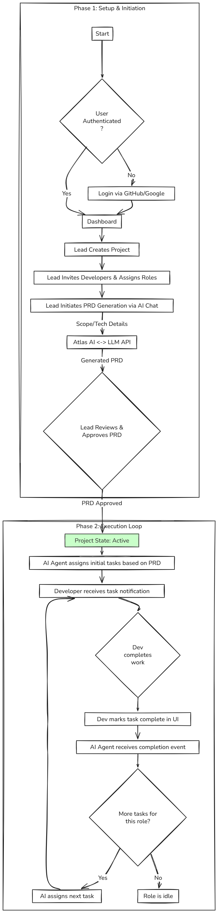
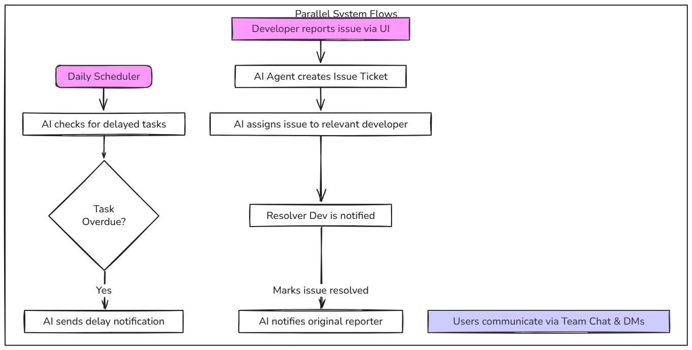

# Atlas: Feature Outline & Application Flow

This document provides a high-level overview of the features and the primary user flow for the Atlas application.

## 1. Feature Outline (Concise)

*   **User Management:**
    *   Login via GitHub/Google.
    *   Leads create projects and invite team members.
    *   Role-based permissions (e.g., Lead, Developer).

*   **AI Project Setup:**
    *   Lead defines project scope in a chat with the Atlas AI.
    *   AI generates a complete Project Requirements Document (PRD).
    *   Lead reviews and approves the PRD to kick off the project.

*   **Automated Workflow:**
    *   AI automatically assigns tasks based on role and timeline.
    *   Developers mark tasks complete in the UI.
    *   AI assigns the next task upon completion.
    *   AI automatically detects and flags delayed tasks.

*   **Communication & Issues:**
    *   Integrated real-time chat for teams and DMs.
    *   Users report blockers/issues to the AI.
    *   AI auto-creates and assigns issue tickets to the correct developer.
    *   AI manages the notification loop for issue resolution.

## 2. Detailed Application Flow Diagram

This diagram illustrates the detailed lifecycle and feature interactions within the Atlas application.

### Architecture Overview

